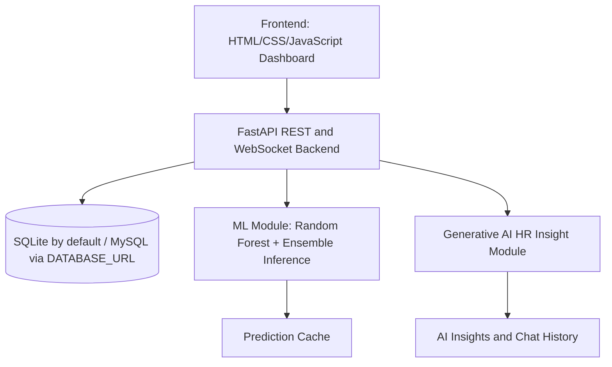

# AI-Enhanced Employee Attendance Management System Architecture

## Main Runtime Flow

1. Employee or HR admin signs in through `/api/auth/login`.
2. Employee marks attendance through `/api/attendance/mark`, `/api/attendance/clock-in`, or `/api/attendance/clock-out`.
3. Attendance records are stored with check-in, check-out, status, and calculated working hours.
4. HR dashboard consumes analytics endpoints for reports, trends, ML predictions, alerts, and GenAI insights.
5. The ML module computes employee attendance features and predicts Regular, At-Risk, or Irregular behavior.
6. The GenAI module calls Gemini when `GEMINI_API_KEY` is configured, otherwise it uses a deterministic HR insight fallback.

## Key Demo Accounts

All seeded accounts use password `password123`.

| Role | Username | Purpose |
| --- | --- | --- |
| HR Admin | `admin` | HR dashboard, reports, analytics, exports |
| Employee | `alice` | Regular attendance profile |
| Employee | `bob` | At-risk attendance profile |
| Employee | `charlie` | Irregular attendance profile |
